# Gradify — Student Learning & Progress Platform

> A full-stack platform for managing courses, assessments, attendance, communication, and student progress in one place.


---

## Table of Contents

- [Project Overview](#project-overview)
- [Problem Statement](#problem-statement)
- [Team Members & Roles](#team-members--roles)
- [Tech Stack Used](#tech-stack-used)
- [System Architecture](#system-architecture)
- [Repository Structure](#repository-structure)
- [Installation Steps](#installation-steps)
- [Environment Variables](#environment-variables)
- [API Endpoints](#api-endpoints)
- [Screenshots](#screenshots)
- [Testing](#testing)
- [Deployment](#deployment)
- [Future Improvements](#future-improvements)
- [Contributing](#contributing)
- [License](#license)
- [Contact](#contact)

---

## Project Overview

**Project Name:** Student Learning & Progress Platform (Gradify)

**Tagline:** Learn smarter, teach better, track everything.

**Description:**
Gradify is a role-based MERN application designed for modern academic workflows. It supports students, instructors, and admins with dedicated dashboards, course and lesson management, assignments, quizzes, attendance tracking, AI-powered doubt support, job/alumni features, and notifications.

---

## Problem Statement

Educational workflows are often split across multiple disconnected tools, making it difficult for institutions to manage learning progress, communication, assessments, and student outcomes efficiently.

Gradify solves this by providing a centralized, scalable platform where:

- Students can access learning resources, submit assignments, attempt quizzes, and track performance.

---

## Team Members & Roles

| Name                | Role                                       | Responsibility                              |
| ------------------- | ------------------------------------------ | ------------------------------------------- |
| Karan Kumar         | Full-Stack Lead & System Architect         | Designed overall system architecture (MERN) |
| Roshan Malviya      | Database & API Integration Engineer        | Assisted in MongoDB schema planning         |
| Vishal Kumar Tiwari | QA & Optimization Engineer                 | Feature testing & validation                |
| Priyanshu Pawar     | Frontend Engineer (UI & Dashboard Systems) | Built dashboard UI components               |

---

## Tech Stack Used

### Frontend

- React
- Tailwind CSS
- Zustand
- React Router
- Axios

### Backend

- Node.js
- Express.js
- Mongoose
- JWT Authentication
- Cloudinary

### Database

- MongoDB

### Hosting

- Netlify
- Render
- MongoDB Atlas

### Tools & Integrations

- Cloudinary (media storage)
- Web Push (VAPID notifications)
- Nodemailer (email service)
- Groq API (AI features)
- ***

## System Architecture

The frontend communicates with backend REST APIs for authentication, role-based data access, and core learning workflows. The backend handles business logic, validation, and persistence in MongoDB while integrating third-party services for media uploads, email delivery, push notifications, and AI interactions.

```text
[Client] -> [Frontend] -> [Backend API] -> [Database]
                         -> [Third-party Services]
```

---

## Repository Structure

```text
Gradify/
├── backend/
│   ├── src/
│   │   ├── config/
│   │   ├── controllers/
│   │   ├── middlewares/
│   │   ├── models/
│   │   ├── routers/
│   │   └── utils/
│   └── package.json
└── frontend/
    ├── src/
    ├── public/
    └── package.json
```

---

## Installation Steps

### Prerequisites

- Node.js: v18+
- npm: v9+
- Database: MongoDB Atlas (or local MongoDB)

### 1) Clone the repository

```bash
git clone https://github.com/imksh/NavKalpana-RICR-NK-0020
cd Gradify
```

### 2) Install backend dependencies

```bash
cd backend
npm install
```

### 3) Configure backend environment variables

Create a `.env` file in `backend/` and add required keys.

### 4) Install frontend dependencies

```bash
cd ../frontend
npm install
```

### 5) Run the project

Backend:

```bash
cd ../backend
npm run dev
```

Frontend:

```bash
cd ../frontend
npm run dev
```

### 6) Open in browser

Frontend URL: http://localhost:5173  
Backend URL: http://localhost:5001

### 7) Seed initial data (optional)

```bash
cd ../backend
npm run seed
```

---

## Environment Variables

> Fill with real values before deployment.

### Backend (`backend/.env`)

```env
NODE_ENV=development
PORT=5001
MONGODB_URI=<your_mongo_uri>
JWT_SECRET=<strong_secret>
JWT_EXPIRES_IN=7d
CLOUDINARY_CLOUD_NAME=<cloudinary_name>
CLOUDINARY_API_KEY=<cloudinary_key>
CLOUDINARY_API_SECRET=<cloudinary_secret>
EMAIL_HOST=<smtp_host>
EMAIL_PORT=<smtp_port>
EMAIL_USER=<smtp_user>
EMAIL_PASS=<smtp_password>
FRONTEND_URL=http://localhost:5173
VAPID_SUBJECT=mailto:you@example.com
VAPID_PRIVATE_KEY=<vapid_private_key>
VAPID_PUBLIC_KEY=<vapid_public_key>
GROQ_API_KEY=<groq_api_key>
GROQ_MODEL=<primary_model>
GROQ_FALLBACK_MODEL=<fallback_model>
```

### Frontend (`frontend/.env`)

```env
VITE_API_BASE_URL=http://localhost:5001
VITE_APP_NAME=Gradify
VITE_VAPID_PUBLIC_KEY=<vapid_public_key>
```

---

## API Endpoints

Core API groups are listed below. Update route paths if your router prefixes differ.

### Base URL

```
Production: https://navkalpana-ricr-nk-0020.onrender.com
Local: http://localhost:5001
```

### Auth

| Method | Endpoint           | Description                                | Auth Required |
| ------ | ------------------ | ------------------------------------------ | ------------- |
| POST   | /api/auth/register | Register a new user account                | No            |
| POST   | /api/auth/login    | Authenticate user and return token/session | No            |
| POST   | /api/auth/logout   | Invalidate current user session            | Yes           |

### Student

| Method | Endpoint             | Description                        | Auth Required |
| ------ | -------------------- | ---------------------------------- | ------------- |
| GET    | /api/student/profile | Fetch student profile and metadata | Yes           |
| PUT    | /api/student/profile | Update student profile details     | Yes           |

### Instructor

| Method | Endpoint                  | Description                              | Auth Required |
| ------ | ------------------------- | ---------------------------------------- | ------------- |
| GET    | /api/instructor/dashboard | Instructor analytics and course overview | Yes           |

### Course

| Method | Endpoint    | Description                         | Auth Required |
| ------ | ----------- | ----------------------------------- | ------------- |
| GET    | /api/course | List available courses with filters | Optional      |
| POST   | /api/course | Create a new course                 | Yes           |

### Admin

| Method | Endpoint         | Description                             | Auth Required |
| ------ | ---------------- | --------------------------------------- | ------------- |
| GET    | /api/admin/stats | Platform-level statistics and summaries | Yes           |

### Public

| Method | Endpoint           | Description                          | Auth Required |
| ------ | ------------------ | ------------------------------------ | ------------- |
| GET    | /api/public/health | Health check endpoint for monitoring | No            |

### Other Available Modules

- `AI`: conversation and model routes
- `Assignments`: create, submit, review workflows
- `Attendance`: session-wise attendance tracking
- `Quizzes`: quiz creation, attempts, and results
- `Jobs & Alumni`: career opportunities and alumni data
- `Push`: subscription and notification delivery

---

## Screenshots

> Place screenshot files under `docs/screenshots/`.

### Landing Page

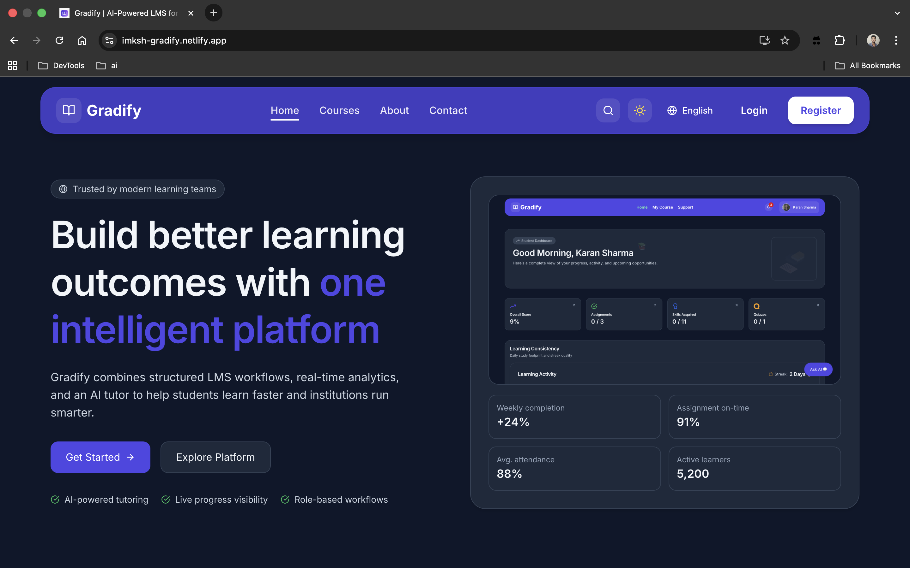

### Student Dashboard

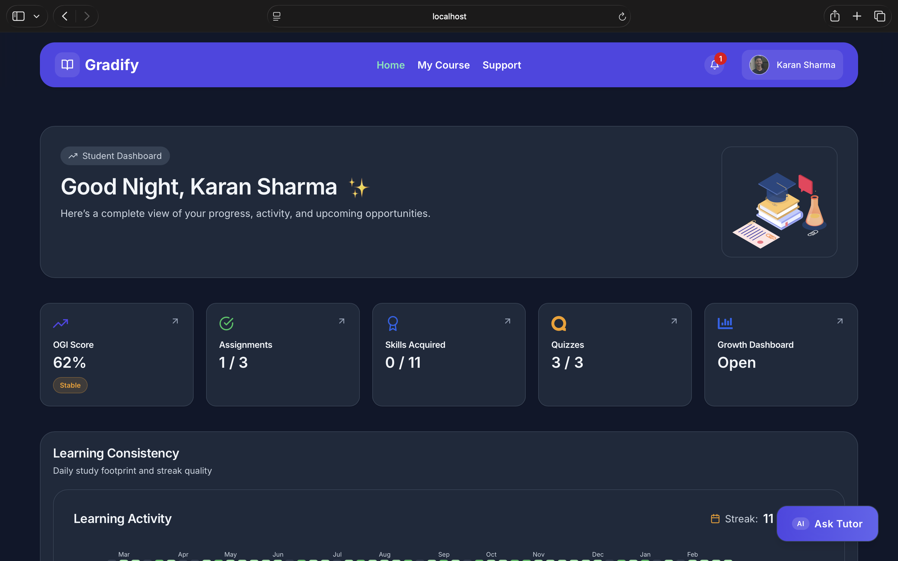

### My Courses

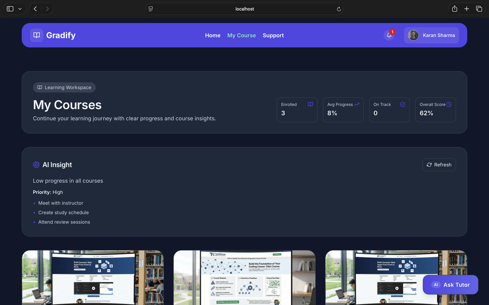

### Lesson Page

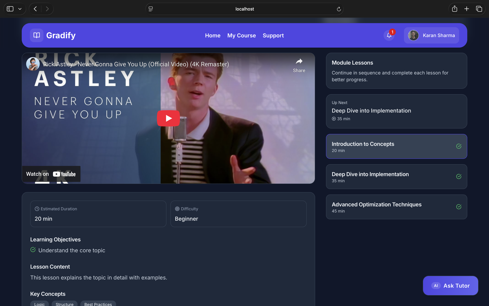

### Learning Support

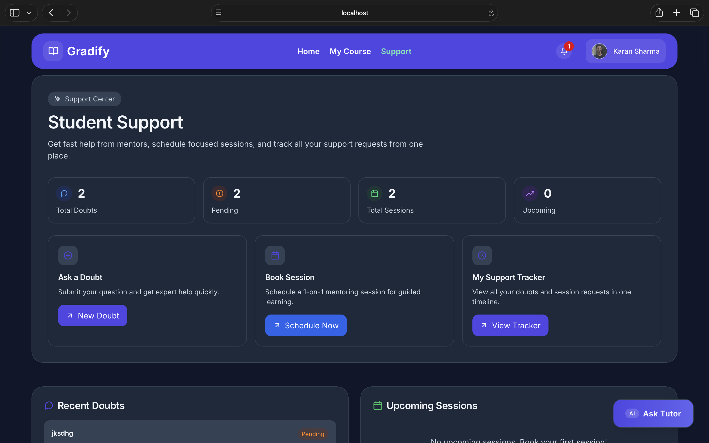

### Growth Dashboard

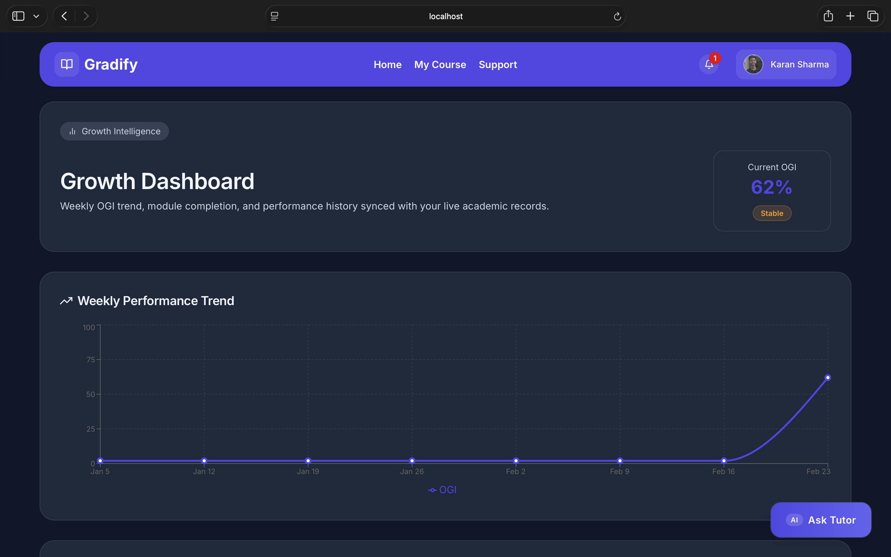

### My Profile

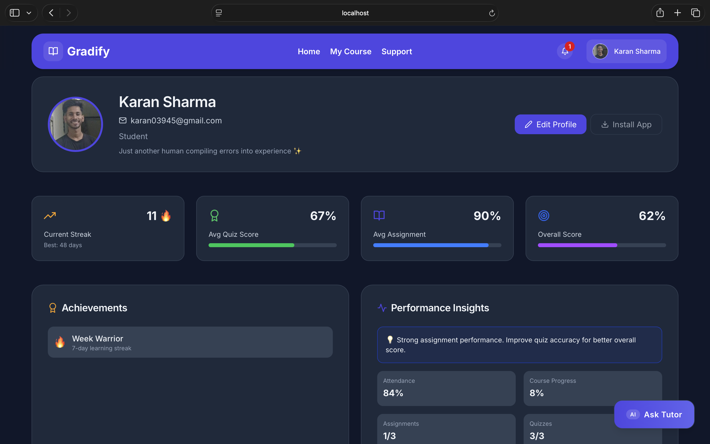

### Assignments

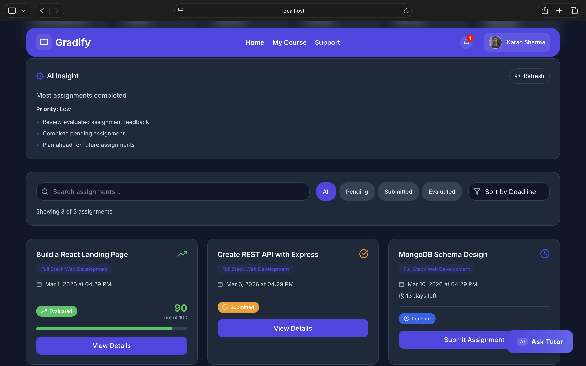

### Attendance

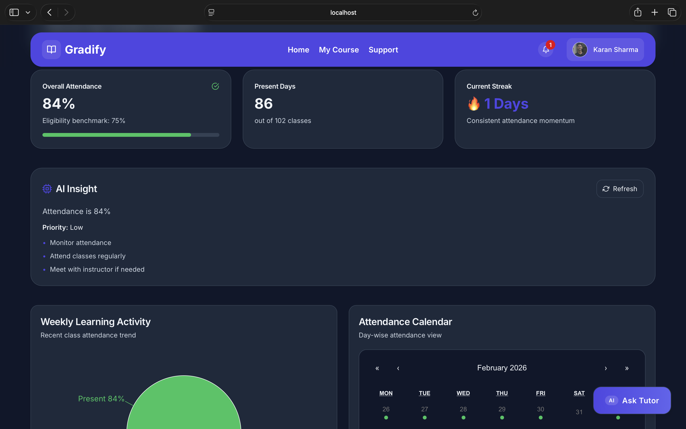

### Quizzes

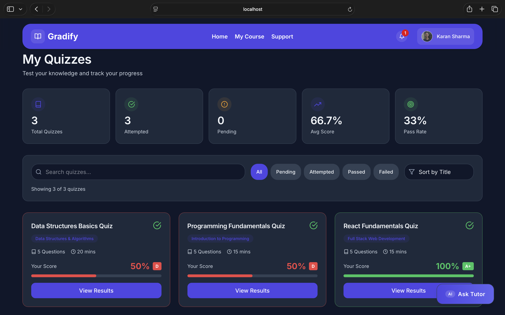

### Quiz Page

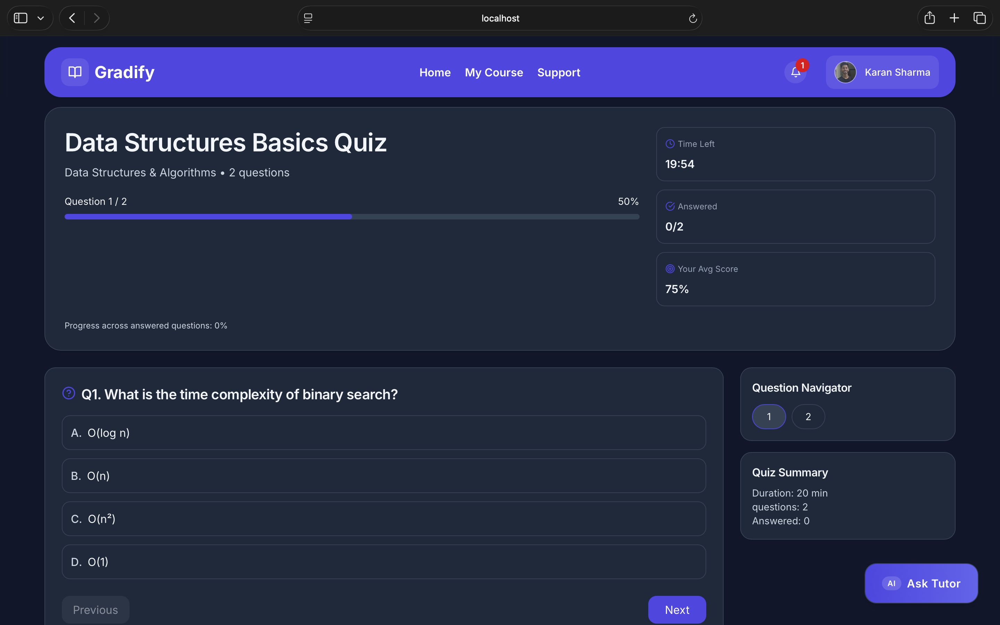

### Progress And Tracking

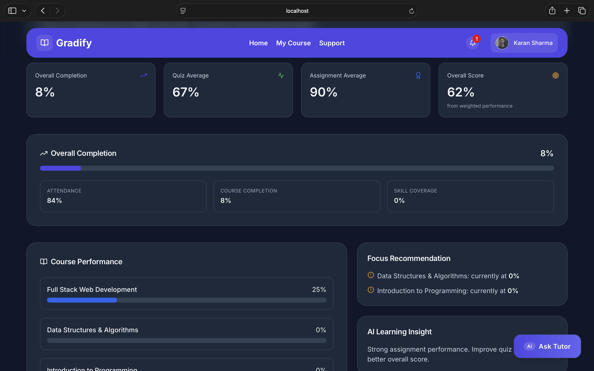

### Jobs And Internships

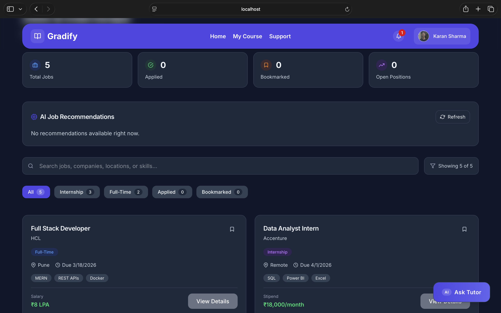

---

## Testing

Automated unit/integration tests are not configured yet. Current verification flow:

### Backend

```bash
cd backend
npm run dev
```

### Frontend

```bash
cd frontend
npm run dev
```

### Linting

```bash
cd frontend
npm run lint
```

### Production Build

```bash
cd frontend
npm run build
```

---

## Deployment

### Frontend Deployment

- Platform: Netlify
- Live URL: https://imksh-gradify.netlify.app

### Backend Deployment

- Platform: Render
- Live URL: https://navkalpana-ricr-nk-0020.onrender.com

### Database

- Provider: MongoDB Atlas
- Cluster/Region: Cluster0/AWS / Mumbai (ap-south-1)

---

## Future Improvements

- Student dashboard deep integration with instructor and admin workflows
- Real-time updates via Socket.IO for announcements, grading, and progress events
- Enhanced online/offline push notification strategy with retry handling
- Role-based analytics and reporting export (CSV/PDF)
- Automated CI/CD pipelines with staging and production environments

---

## Contributing

1. Fork the repository.
2. Create a feature branch.
3. Commit your changes.
4. Push the branch.
5. Open a pull request.

---

## License

This project is currently licensed under the **ISC License**.

---

## Contact

**Project Maintainer:** Karan Kumar

**Email:** karan03945@gmail.com

**Project Repository:** https://github.com/imksh/NavKalpana-RICR-NK-0020.git

---

## Acknowledgements

- MERN open-source ecosystem contributors
- Netlify, Render, and MongoDB Atlas platform support
- Academic mentors and peer reviewers for product feedback
